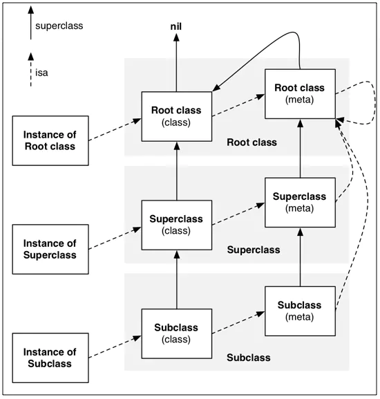

学习《Effective Objective-C 2.0  编写高质量iOS与OS X代码的52个有效方法（第二版）》笔记

edit by 猫耳堀川雷鼓/neko-horikawaraiko

### 1.了解Objective-C语言的起源

- oc在运行期才会检查对象类型、查找要执行的方法
- oc对象实例放在堆中，在`int`、`char`等非对象类型与指针一般放在栈中

### 2.在类的头文件中尽量少引入其他头文件

- 用到其他类时使用`@class`关键字前向声明
- 遵循协议无法使用前向声明，则在分类中声明遵循该协议`@implementation ClassA ()<Protocol>`

### 3.多用字面量语法，少用与之等价的方法

- 值`@1 @2.5f @YES @'a' @(x*y)`
- 不可变数组`@[@"cat", @"dog];`
- 不可变字典`@{@"FirstName":@"Matt", @"age":@28};`
- 上述字面量语法创建的数值、数组、字典为不可变对象
- 用字面量创建这些数组、字典对象在遇到`nil`时会抛异常，而使用`arrayWithObjects:`之类的方法遇到`nil`会直接提前结束而不报异常

### 4.多用类型常量，少用`#define`预处理指令

- `static const NSTimeInterval kAnimationDuration = 0.3;`

  ```objective-c
  // 全局常量
  // "XXX.h"
  extern NSString *const EOCStringConstant; // 声明
  
  // "XXX.m"
  NSString *const EOCStringConstant = @"VALUE"; // 定义
  ```

- 常量名称：只在某“编译单元”（.m文件）中可用时前缀加k，整个项目都可用时以相关联的类名为前缀
- 加`static`保证只在本文件有用，不加则默认为变量创建外部符号，其他文件中同名变量会报错
- 在每个用到这个全局变量的.m都写`extern`，或者在.h文件中写了而.m包含该.h效果相同

### 5.用枚举表示状态、选项、状态码

- 实现枚举所用的数据类型取决于编译器
- 需要多个选项可用时，各选项的值定为2的幂次，以便通过按位或组合
- 用`NS_ENUM`或者`NS_OPTIONS`宏定义枚举类型时可指明所使用的底层数据类型
- 处理枚举类型的`switch`语句不写`default`分支，以便添加新枚举项时编译器提醒开发者未处理所有枚举

### 6.理解“属性”这一概念

- 用`@property`生成的实例变量，为在属性名前加前缀下划线
- 在类实现中使用`@dynamic`可禁止编译器对属性自动合成存取方法与实例变量，但是访问这些属性不会报警示

  ```objective-c
  @interface EOCPerson : NSManagerObject
  @property NSString *fistName;
  @property NSString *lastName;
  @end

  @implementation EOCPerson
  @dynamic firstName, lastName;
  @end
  ```

- `atomic`（默认）、`nonatomic`：是否原子性
- `readwrite`（默认）、`readonly`：外部读写性。可以对外公开为只读，而在分类中重新定义为读写（[第27条](#27使用class-continuation分类隐藏实现细节)）
- `assign`对简单值类型赋值；`strong`“拥有”，保留新值，释放旧值，再把新值设置上去；`weak`“非拥有”，不保留新值，不释放旧值，所指对象销毁时该属性清空；`unsafe_unretained`对对象类型的assign，“非拥有”，所指对象销毁时属性值不清空；`copy`深拷贝
- `getter=<name>`name换为方法名，重设属性的获取方法名；`setter=<name>`name换为方法名，重设属性的设置方法名，不常见
- 注意自己实现相应存取方法时要对应所声明的特质，比如声明特质有`copy`，自定设置方法中就要深拷贝相关对象
- 即使不是存取方法，比如是初始化方法，也要遵循上述规则。这个特殊情况存在就是因为不应在初始化方法、销毁方法中调用存取方法（[第7条](#7在对象内部尽量直接访问实例变量)）
- iOS开发中属性基本全部为`nonatomic`，因为并不能保证线程安全（iOS机制决定？）而且会严重增加性能消耗

### 7.在对象内部尽量直接访问实例变量

- 对象内部读取数据使用实例变量，写入数据使用属性
- 特例：初始化方法与`dealloc`方法使用实例变量读写数据（子类可能会重写设置方法）。特例的特例：带初始化的实例变量在超类且无法直接访问到，只能使用设置方法
- 特例：惰性初始化的数据使用属性读取数据

### 8.理解“对象等同性”这一概念

- 检测自定义对象等同性需要实现`isEqual:`方法和`hash`方法，相同对象的hash码必须相同
- 根据需要对所需属性进行检测以判断对象是否相同，不要盲目全部判断
- `hash`算法要尽量计算速度快且哈希碰撞率低

### 9.以“类族模式”隐藏实现细节

- 类族模式把实现细节隐藏在公共接口后面，如`UIButton`类的`+ (UIButton*)buttonWithType:(UIButtonType)type;`方法，通过工厂模式创建具体的button类型
- 从类族的公共抽象基类继承出子类时需要阅读开发文档，明确数据存储方式、需要重写的方法等细节

### 10.在既有类中使用关联对象存放自定义数据

- 最好，当自己需要实现某一子类来存放相关信息，却无法使用超类的机制创建自定子类实例时，可以使用“关联对象”存放信息。因为这种做法会引入引用环等bug
- “关联对象”指定的内存管理语义和属性定义时的内存管理语义相似
- 设置方式：`void objc_setAssociatedObject(id object, void* key, id value, objc_AssociationPolicy policy)`以给定的policy（内存管理语义），给object的key设定相应value。通常使用静态全局变量做key。（类比`NSDictionary`，但是`NSDictionary`对key相等内部实现是判断`isEqual:`，而关联对象的key相等内部判断是需要指针相等，因此使用静态全局变量做key）

### 11.理解objc_msgSend的作用

- 向对象发送消息相当于在该对象上调用`objc_msgSend()`方法并传递参数进去

### 12.理解消息转发机制

- 完整过程（两大阶段）
  - 动态方法解析：问接收者能否动态添加方法来处理传来的“未知的selector”
  - 完整的消息转发机制：上一阶段无法动态添加时
    - 问接收者看看有没有其他对象可以处理这条消息，若有则转给那个对象（备援接收者，replacement receiver）
    - 若没有，系统则将消息全部细节封装到`NSInvocation`对象中，让接收者设法处理
  
- 动态方法解析：对象无法解读消息，调用自己类的`+(BOOL)resolveInstanceMethod:(SEL)selector`或者`+(BOOL)resolveClassMethod:(SEL)selector`判断能不能添加方法处理selector。需要相关代码已经写好，在需要时直接插到类中就可以的那种情况，常用来实现`@dynamic`属性。举例：

  ```objective-c
  id autoDictionatyGetter(id self, SEL _cmd);
  void autoDictionarySetter(id self, SEL _cmd, id value);
  
  + (BOOL)resolveInstanceMethod:(SEL selector) {
      NSString *selectorString = NSStringFromSelector(selector);
      if (/* selector is from a @dynamic property */) {
          if ([selectorString hasPrefix:@"set"]) {
              Class_addMethod(self, selector, (IMP)autoDictionarySetter, "v@:@");
          } else {
              Class_addMethod(self, selector, (IMP)autoDictionaryGetter, "@@:");
          }
          return YES;
      }
      return [super resolveInstanceMethod:selector];
  }
  ```

- 备援接收者：对象可以通过`+(id)forwardingTargetForSelector:(SEL)selector`返回可以处理该消息（selector）的对象，比如对象将可以处理消息的子对象返回
- 完整的消息转发：创建`NSInvocation`对象，将selector、目标（target）、参数等所有细节包含其中。消息派发系统（message-dispatch system）将该消息对象指派给目标对象。对象可以通过调用`-(void)forwardInvocation:(NSInvocation*)invocation`改变调用目标，将消息转给新对象。这种方式与备援接受者方式相同，故常常当需要改变消息内容（追加参数、改变selector等）时才会进行方法实现。并且若发现某操作不应由本类处理，则需调用超类同名方法。

### 13.用“方法调配技术”调试“黑盒方法”

- 使用另一份实现替换原有的方法实现，称为“方法调配”。一般只在调试程序时候才用此技术，向“完全不知道具体实现”的黑盒方法的原有实现中添加新功能，比如增加日志记录功能。该种方法不宜滥用。

- 在选择子映射表（selector table）中，每个选择子（selector）名称映射一个方法实现，在表中以IMP类型函数指针表示。“方法调配”技术就是通过调用特定方法操作该表实现的。

- 举例

  ```objective-c
  Method originalMethod = class_getInstanceMethod([NSString class],@selector(lowercaseString));
  Method swappedMethod = class_getInstanceMethod([NSString class],@selector(uppercaseString));
  method_exchangeImplementations(originalMethod, swappedMethod);
  ```

### 14.理解“类对象”的用意

- 编译器会假定`id`类型的对象可以响应所有消息

  ```objective-c
  //  class为objc_class *类型的结构体
  typedef struct objc_class *Class;
  
  //  objc-private.h
  struct objc_object {
      isa_t isa;
  }
  
  //  objc-runtime-new.h
  struct objc_class : objc_object {
      ......
      // 包含Class ISA;
      Class superclass;
      cache_t cache;      //  方法缓存         
      class_data_bits_t bits;    //  & FAST_DATA_MASK之后，在class_rw_t *中获取类的具体信息
      ......
  }
  
  struct class_rw_t {
      uint32_t flags;
      uint32_t version;
      const class_ro_t *ro;
      method list t * methods;   // 方法列表
      property_list_t *properties;   // 属性列表
      const protocol _list_t * protocols;   // 协议列表
      Class firstSubclass:
      Class nextSiblingClass;
      char *demangledName;
  }
  
  struct class_ro_t {
      uint32_t flags;
      uint32_t instanceStart;
      uint32_t instanceSize;  //  instance对象占用的内存空间
  #ifdef  __LP64__
      uint32_t reserved;
  #endif
      const uint8_t * ivarLayout;
      const char *name;  // 类名
      method_list_t * basevethodList;
      protocol_list_t * baseProtocols;
      const ivar_list_t * ivars; // 成员变量列表
      const_uint8_t * weakIvarLayout;
      property_list_t *baseProperties;
  }
  ```

- 每个继承自`NSObject`根类（根类：`NSObject`、`NSProxy`）的对象最终都会包含一个objc_object结构体，即首个成员都是一个Class类型的isa指针。此处“对象”包含**实例对象、类对象、元类对象**。`[obj class]`与`object_getClass(obj);`可以获取到类对象，`object_getClass([ClassName class]);`可以获取到元类对象。某个类的类对象和元类对象在内存中都只有一个。

- 实例对象结构：isa指针（指向类对象）、成员变量（花括号声明的+属性生成的）的值。
  
  - 类对象结构：isa指针（指向元类对象）、super_class指针（指向父类对象，根类`NSObject`类对象的此指针指向`nil`）、属性（`property`声明的那些）的信息、对象方法（-开头的方法）的信息、协议的信息、成员变量的信息（比如变量类型、变量名等）等（类对象中也是存这些信息的结构体指针，指向外部结构体，实际信息存在外部结构体中）。**不包含父类的属性、成员变量、方法等**
  
  - 元类对象结构：isa指针（指向`NSObject`的元类对象）、super_class指针（指向父类的元类对象，根类`NSObject`元类对象的此指针指向`NSObject`类对象）、类方法（+开头的方法）的信息等



- 查询类型信息（判断是否为某个类实例）：
  - `isMemberOfClass:`判断对象是否为某类的实例
  - `isKindOfClass:`判断对象是否为某类及其派生类的实例
  - `[object class] == [ClassName class]`判断对象是否为某类实例（对象的`-(Class)class`实例方法和类的`+(Class)class`类方法都是返回类对象，此处判断类对象是否为同一个）。但是最好不用这种方法，因为可能object是代理对象，class方法返回来的是`NSProxy`为根类的子类。

### 15.用前缀避免命名空间冲突

- 类的实现文件中所用的C函数及全局变量属于“顶级符号”（top-level symbol），容易与其他文件比如库的使用者的代码中出现命名冲突，需要加上前缀避免冲突

### 16.提供“全能初始化方法”（“指定初始化方法”）

- 一个类多个初始化方法中，需要在文档指明哪一个是全能初始化方法，其他初始化方法使用默认值调用全能初始化方法，或者在不应调用其他初始化方法时抛出异常（不常用）
- 子类的全能初始化方法与父类不同时，从父类继承而来的那个全能初始化方法应被复写（其中再调用子类的全能初始化方法）
- 如果父类初始化方法不适用于子类，子类应复写这个方法并抛异常

### 17.实现description方法

- `NSLog`中`%@`打印方式调用类的`description`方法，自定义类想要输出有用信息需要复写该方法。方法实现可以借用NSDictionary来打印，即

  ```objective-c
  - (NSString*)description {
      return [NSString stringWithFormat:@"<%@: %p, %@>",
              [self class],
              self,
              @{@"title":_title,
                @"latitude":@(_latitude)}
             ];
  }
  ```

- 调试过程中LLDB的po命令调用类的`debugDesctiption`方法，该方法内默认调用`description`方法，可以通过复写`debugDesctiption`方法在调试中输出更详细信息

### 18.尽量使用不可变对象

- “不可变”指readonly
- 可以在分类中（.m文件）重新声明暴露在外（.h文件）的属性，并将暴露属性的readonly特质改为readwrite，但是其他特质必须保持不变
- 需要可变的集合（指set、dictionary等）实现功能时，公开的属性中使用NSSet、NSArray等不可变集合，通过方法来对内部实现的可变集合进行修改

### 19.使用清晰而协调的命名方式

- 方法名：驼峰命名法，开头小写，后面每个单词首字母大写

  类、协议名：Pascal命名法，每个单词首字母大写，但是前面一般有两三个大写字母前缀

- 方法命名
  - 起名像是读一个句子。使用词语全称string而不是类似str这种简称（int这种参数类型的除外）
  - 属性值XXX的获取方法命名“XXX”，设置方法命名“setXXX”。特例是BOOL属性，其获取方法一般命名“isXXX”
  - 返回值若是新创建的，方法名的首个词应为返回值类型
  - 如果方法返回一个非属性的BOOL，应当根据其功能选用has或者is位前缀
  - 把表示参数类型的名词放在紧靠参数的前面，如NSString类的`- (NSUInteger)lengthOfBytesUsingEncoding:(NSStringEncoding)enc`中的Encoding，指参数类型为NSStringEncoding
  - get前缀保留给使用参数来输出结果的那些方法。比如NSString类的`- (void)getCharacters:(unichar *)buffer range:(NSRange)range`方法，buffer为输出结果的参数，此方法则用get前缀
  - 如果方法要在当前对象上执行操作，命名就要包含这个操作的动词。如果这个操作需要参数，则在动词后添加名词说明。比如上例中的get操作，后跟Characters名词

### 20.为私有方法名加前缀

- OC没法控制一个方法是私有还是公共，给司机有方法加前缀可以与共有方法区分开
- 苹果公司保留了单下划线前缀作为私有方法的方式，自己的私有方法需要添加与之不同的前缀

### 21.理解Objective-C错误模型

- 只在极其罕见的情况抛异常（比如创建抽象基类的实例等）处理严重错误，抛异常以后程序直接退出，不再考虑编写“异常安全”代码
- 处理不严重错误时可以使用委托方法将`NSError`信息转给委托对象来处理错误，或者把错误信息放在`NSError`“输出参数”（使用传入的参数来输出数据）中返回给调用者

### 22.理解`NSCopying`协议

- 想要自己的类的实例可以拷贝，就要实现`NSCopying`协议（的`copyWithZone`方法）
- 如果自定义对象有可变和不可变版本，就要实现`NSCopying`协议和`NSMutableCopying`协议（`mutableCopyWithZone`）
- `copy`方法返回对象不可变版本（如`NSArray`），`mutableCopy`方法返回对象可变版本（如`NSMutableArray`），不论本来对象可变还是不可变
- 拷贝对象一般实行浅拷贝，除非相关文档中说以深拷贝实现，或者需要寻找对象有无深拷贝方法（如`NSSet`类的`- (instancetype)initWithSet:(NSSet<ObjectType> *)set copyItems:(BOOL)flag`方法，通过flag控制是否深拷贝）。如果自定义对象需要深拷贝，可考虑另外实现深拷贝方法

### 23.通过委托与数据源协议进行对象间通信

- 将委托对象应该支持的接口定义成协议，在协议中把可能需要处理的事件定义成方法

- 委托对象：含有被委托对象的强指针；声明遵守协议，实现协议方法，在被委托对象发消息过来（调用协议中的方法）时处理后续事项
  
  被委托对象：含有委托对象的弱指针`@property (nonatomic, weak) id<XXXDelegate> delegate;`，进行事件处理，并将处理好的结果发消息（调用协议中的方法）出去
  
- 如果有必要（反复查询委托对象是否相应某选择子比较耗性能时等），可实现还有位域的结构体，将委托对象能否相应相关协议方法这一信息缓存其中，使用时只判断相应位域的值即可。如

  ```objective-c
  @interface EOCNetworkFetcher : NSObject
  @property (nonatomic, weak) id<EOCNetworkFetcherDelegate> delegate;
  @end
  
  @interface EOCNetworkFetcher () {
      struct {
          unsigned int didReceiveData      : 1;
          unsigned int didFailWithError    : 1;
          unsigned int didUpdateProgressTo : 1;
      } _delegateFlags;
  }
  @end
  
  @implementation EOCNetworkFetcher
  - (void)setDelegate:(id<EOCNetworkFetcherDelegate>)delegate {
      _delegate = delegate;
      _delegateFlags.didReceiveData = [delegate 
          respondsToSelector:@selector(networkFetcher:didReceiveData:)];
      _delegateFlags.didFailWithError = [delegate 
          respondsToSelector:@selector(networkFetcher:didFailWithError:)];
      _delegateFlags.didUpdateProgressTo = [delegate 
          respondsToSelector:@selector(networkFetcher:didUpdateProgressTo:)];
  }
  //...
  @end
  ```

### 24.将类的实现代码分散到便于管理的数个分类中

- 类过于臃肿时，可以根据功能将不同函数放入不同分类
- 可以将应当“私有”的方法建一个“Private”分类，在本程序库内使用，而对外隐藏实现细节

### 25.总是为第三方类的分类名称加前缀

- 向第三方类（不管是苹果给的原生类或者第三方库下载来的类）中添加分类、方法时，要加上含有自己特点的前缀，避免分类、方法间互相覆盖

### 26.勿在分类中声明属性

- 在“class-continuation分类”之外的其他分类中，都无法向类中增加实例变量，所以声明了属性编译器也没法将实例变量合成出来。所以属性一般定义在主接口中（及class-continuation分类中），而其他分类中可以定义属性的存取方法

### 27.使用“class-continuation分类”隐藏实现细节

- “class-continuation分类”是一个没有名字的分类（括号里没有名字），且必须定义在类的主实现文件（.m）里。它是唯一能声明实例变量的分类
- 因此如果想把公开的只读属性扩展为内部可读写，也只能在“class-continuation分类”中做
- 不想让外人知道的遵守的协议也可在“class-continuation分类”中声明
- 不想让外人知道的私有方法也可在“class-continuation分类”中声明（声明是不强制要求的，但是声明了，类都拥有什么方法会比较清晰）

### 28.通过协议提供匿名对象

- 不想让人知道哪个具体类型、类型不重要而里面有没有某些方法才重要，之类的情况可以用遵守某协议的id匿名对象来表示

### 29.理解引用计数

- ARC（自动引用计数）环境中与引用计数相关的方法无法使用（`retain`、`release`、`autorelease`、`dealloc`、`retainCount`）
- 引用计数>0时对象存活，=0时对象销毁。保留与释放操作对应递增递减引用计数
- 循环引用导致内存泄漏，通常使其中一个改为弱引用，或者外界命令其中某个对象不再强引用（保留）另一个对象来打破循环

### 30.以ARC简化引用计数

- ARC会在代码中合适地方插入“保留”与“释放”代码，使用ARC时程序员可基本不用再管内存管理
- 以`alloc`、`new`、`copy`、`mutableCopy`开头的函数返回的对象归调用者所有（OC的命名规则），调用者负责释放。但实际上ARC也帮忙处理了这些，所以也不用考虑内存管理
- ARC只负责OC对象的内存管理，比如CoreFoundation对象不归ARC管理，还需要手动调用`CFRetain`/`CFRelease`。

### 31.在`dealloc`方法中只释放引用并解除监听

- 在ARC中，普通的OC对象释放已经默认实现，不需要再手动释放。只有一些特殊情况才重写`dealloc`方法
- 如30条所说的CoreFoundation对象需要在`dealloc`方法调用`CFRetain`/`CFRelease`来释放
- 注册（register）的键值观测（KVO）、NSNotificationCenter等通知需要在`dealloc`方法取消注册
- 对象持有的大开销资源或系统内稀缺资源，如文件描述符、套接字、大块内存等不在`dealloc`中释放，而是实现类似名为close等的方法释放，并且与使用者约定使用完资源要调用这个方法
- `dealloc`中尽量不要调用其他方法，而执行异步任务的方法、只能在对象正常状态下执行的方法、属性存取方法等坚决不能在`dealloc`中调用

### 32.编写“异常安全代码”时留意内存管理问题

- 手动管理内存时，try块内创立的对象需要清理干净，比如在finally块中调用release
- ARC的默认情况下不生成处理安全异常所需的代码，因为会增大程序包且降低运行效率。OC++模式时编译器会自动打开标志来生成处理安全异常所需的代码

### 33.以弱引用避免保留环

- 将保留环中某些引用设为`unsafe_unretained`或者`weak`可以避免保留环成环，不过现在一般使用`weak`。`unsafe_unretained`引用的对象在被回收后，该引用仍然指向对象；而`weak`引用的对象在被回收后，引用置空，所以更安全一些

### 34.以“自动释放池块”降低内存峰值

- 目前常用的`@autorelease`写法为更轻便的自动释放池，可以放在循环大量创建对象那个循环体里来自动释放临时对象，降低内存峰值

### 35.用“僵尸对象”调试内存管理问题

- 将NSZombieEnabled环境变量设为YES可以开启“僵尸对象”，此对象由要回收的对象转化而成（实际上不回收，只是运行期转为僵尸对象），此对象可响应所有选择子，具体实现为打印一条消息并终止程序

### 36.不要使用`retainCount`

- `retainCount`可能会根据编译器具体实现、方法内所做操作而有与直觉不同的数值，所以反正不要用就对了

### 37.理解“块”这一概念

- 块是一种闭包，语法类似于C++的匿名函数，以^开头，如

  ```objective-c
  int (^addBlock)(int a, int b) = ^(int a, int b) {
      return a + b;
  };
  ```

- 块可以捕获声明它的那个范围内的所有变量，比如声明它的函数内的局部变量。类的实例方法内声明的块可以捕获实例变量，当然此时连带self也一起捕获

- <span id="37_3">块捕获的变量是对象时会拥有它（强引用），因此类中声明的块要注意保留环问题，比如类的实例（self）拥有其他对象，其他对象拥有块，块拥有self</span>

- 块捕获的变量一般不可变。需要改变时，该变量要在声明的开头加`__block`修饰符，如

  ```objective-c
  NSArray *array = @[@1, @2, @3];
  __block NSInteger count = 0;
  [array enumerateObjectUsingBlock:^(NSNumber *number, NSUInteger idx, BOOL *stop) {
          if ([number compare:@2] == NSOrderedAscending) {
              count++;
          }
      }];
  ```

- 块定义在大括号里为分配在栈上，出了大括号就自动回收了。想要保留块需要给它发送`copy`消息，块就变为拷贝一份到堆上，就可以用ARC管理堆上这个的生命周期（大概也是属性使用copy修饰的原因？）

  ```objective-c
  void (^block)();
  if (/* some condition */) {
      block = [^{
          NSLog(@"Block A");
      } copy];
  } else {
      block = [^{
          NSLog(@"Block B");
      } copy];
  }
  block();
  ```

### 38.为常用的块类型创建`typedef`

- 需要时可用`typedef`创建块的类型别名以便于使用

  ```objective-c
  typedef void(^EOCCompletionHandler)(NSData *data, NSError *error);
  - (void)startWithCompletionHandler:(EOCCompletionHandler)completion;
  ```

- 类型别名也是一种类型，不要与现有类名冲突
- 相同多处块可以提出来定义类型别名，相改变参数时就能一改全改。但是不同用处的相同类型（入参、返回值）的块还是定义不同的类型别名为好，否则一改全改时会互相影响

### 39.用handler块降低代码分散程度

- 需要回调时通常通过代理或块执行某些代码，使用块可以将业务逻辑放在一块，而不需要像代理那种提出来方法写

  ```objective-c
  /************ 代理方式 ************/
  @class EOCNetworkFetcher;
  @protocol EOCNetworkFetcherDelegate <NSObject>
  - (void)networkFetcher:(EOCNetworkFetcher)networkFetcher
       didFinishWithData:(NSData*)data;
  @end
  
  @interface EOCNetworkFetcher : NSObject
  @property (nonatomic, weak) id<EOCNetworkFetcherDelegate> delegate;
  - (id)initWithURL:(NSURL*)url;
  - (void)start;
  @end
  
  // 其他类中使用
  - (void)FetchFooData {
      NSURL *url = [[NSURL alloc] initWithString:"http://..."];
      _fooFetcher = [[EOCNetworkFetcher alloc] initWithURL:url];
      _fooFetcher.delegate = self;
      [_fooFetcher start];
  }
  - (void)FetchBarData {
      NSURL *url = [[NSURL alloc] initWithString:"http://..."];
      _barFetcher = [[EOCNetworkFetcher alloc] initWithURL:url];
      _barFetcher.delegate = self;
      [_barFetcher start];
  }
  - (void)networkFetcher:(EOCNetworkFetcher)networkFetcher
       didFinishWithData:(NSData*)data {
      if (networkFetcher == _fooFetcher) {
          _fetchedFooData = data;
          _fooFetcher = nil;
      } else if (networkFetcher == _barFetcher) {
          _fetchedBarData = data;
          _barFetcher = nil;
      }
      // etc...
  }
  
  
  /************ 块方式 ************/
  typedef void(^EOCNetworkFetcherCompletionHandler)(NSData *data);
  
  @interface EOCNetworkFetcher : NSObject
  - (id)initWithURL:(NSURL*)url;
  - (void)startWithCompletionHandler:(EOCNetworkFetcherCompletionHandler)handler;
  @end
  
  // 其他类中使用
  - (void)FetchFooData {
      NSURL *url = [[NSURL alloc] initWithString:"http://..."];
      EOCNetworkFetcher *fetcher = [[EOCNetworkFetcher alloc] initWithURL:url];
      [fetcher startWithCompletionHandler:^(NSdata *data) {
          _fetchedFooData = data;
      }];
  }
  - (void)FetchBarData {
      NSURL *url = [[NSURL alloc] initWithString:"http://..."];
      EOCNetworkFetcher *fetcher = [[EOCNetworkFetcher alloc] initWithURL:url];
      [fetcher startWithCompletionHandler:^(NSdata *data) {
          _fetchedBarData = data;
      }];
  
  }
  ```

- 比如下载数据这种情况，下载成功和失败可以分别用两个块来处理，一个接受`NSData`参数一个接受`NSError`参数这样，也可以用一个块里分`if`来处理。用一个块的好处在于：可以用已经下载的一部分数据做额外处理，还可以在判断下载数据过短这类情况下，在当前方法内与失败共同使用一份处理代码而不用额外提出方法
- 可以加一个`NSOperationQueue`参数来让调用者决定把块放在哪个队列执行

### 40.用块引用其所属对象时不要出现保留环

- <a href='#37_3'>第37条第三点</a>提到部分
- 适时打破保留环，比如分析块用过就不用了，就可以在用过一次之后将块（对象）置`nil`

### 41.多用派发队列，少用同步锁

- GCD（Grand Central Dispatch）技术（将消息收集到中枢再派发到不同线程队列执行的技术），出现之前使用的同步锁技术有下列等，但是仍然可能会产生死锁，以及效率不高

  ```objective-c
  // 同步块
  @synchronized(objectName) {
      // 要加锁同步执行的代码块
  }
  
  // NSLock对象、NSRecursiveLock“递归锁”对象
  _lock = [[NSLock alloc] init];
  - (void)synchronizedMethod {
      [_lock lock];
      // 要加锁同步执行的代码块
      [_lock unlock];
  }
  ```

- 串行与并发
  - 串行：**必须一个一个**的执行，必须等上一个任务执行完成之后才能开始下一个，而且一定是按照先进先出的顺序执行的
  - 并发：**可以同时**执行，也是按照先进先出的原则调用的
    - 并发与并行：并发是逻辑概念上同时，两个任务可以用一个CPU交替执行；并行是物理概念上同时，必须两个CPU，两个任务在两个CPU上执行
  
- 同步与异步
  - 同步：这个函数（或代码块）执行完成之后才会执行下面的代码。一般在当前线程中执行任务，不会开启新的线程。向队列里面添加任务时，等添加的任务完成之后再返回
  - 异步：不管调用的函数有没有执行完，都会继续执行下面的代码。具备开启新线程的能力。向队列里面添加任务后立即返回
  
- 获取队列、任务添加、栅栏块

  ```objective-c
  // 串行队列
  dispatch_queue_t serialQueue;
  serialQueue = dispatch_queue_create("mySerialQueue", NULL); // 创建（参数2使用NULL或者DISPATCH_QUEUE_SERIAL)
  dispatch_queue_t mainQueue = dispatch_get_main_queue(); // 获取主（串行）队列，必须小心安排任务顺序
  // 并发队列
  dispatch_queue_t concurrencyQueue;
  concurrencyQueue = dispatch_queue_create("myConcurrencyQueue", DISPATCH_QUEUE_CONCURRENT); // 创建
  concurrencyQueue = dispatch_get_global_queue(DISPATCH_QUEUE_PRIORITY_DEFAULT, 0); // 获取全局并行队列（参数1区别高、中、低、后台优先级）
  // 代码运行在的（当前）队列
  dispatch_queue_t currentQueue = dispatch_get_current_queue();
  
  // 添加同步任务，根据官方文档，在大多数情况下，通过dispatch_sync添加的任务，在哪个线程添加就会在哪个线程执行。
  void dispatch_sync(dispatch_queue_t queue, dispatch_block_t block);
  // 添加异步任务，异步派发要拷贝块，注意考虑运行效率
  void dispatch_async(dispatch_queue_t queue, dispatch_block_t block);
  // queue从上面各种队列取，block为要执行的代码块
  // 总结起来一般情况是，串行同步在当前线程，串行异步新开线程（一个），并发同步在当前线程，并发异步在新开线程（多个）
  
  // 同步栅栏
  void dispatch_barrier_sync(dispatch_queue_t queue, dispatch_block_t block);
  // 异步栅栏
  void dispatch_barrier_async(dispatch_queue_t queue, dispatch_block_t block);
  ```

- 使用串行同步队列可以保证数据同步，更快的方法是并发异步队列执行读取，而写入单独执行。栅栏块必须单独执行，所以可以将写入块设置为栅栏块，具体是同步还是异步，还是说仅使用串行队列而不用并发，需要具体的性能测试来决定

### 42.多用GCD，少用`performSelector`系列方法

- 由于`performSelector`系列方法不知道传给自己的事什么选择子，所以ARC无法确定是否应该将执行返回的对象进行释放，容易造成内存泄漏问题
- `performSelector`系列方法返回值为`id`，而选择子实际返回什么并不一定是对象，还可能是整数浮点数之类，需要麻烦的转换，而且`performSelector`系列方法能传给选择子的参数最多只有两个，也是`id`类型，局限性太大
- 使用`performSelector`系列方法放在另一个线程执行或者延迟一段时间执行，都可以封装成块，用GCD分发相关方法代替

### 43.掌握GCD及操作队列的使用时机

- 与第41条类似，操作队列提供了一种基于GCD的更高层次的封装，操作队列中的操作比GCD的块要重量级。`NSOperationQueue`创建/获取一个队列，`NSOperation`及其子类创建操作，将操作添加到队列中来执行。主队列在主线程执行，其他队列在子线程执行
- 使用操作队列可以：
  - 方便取消操作执行。任务块安排到GCD是无法取消的，而操作安排到操作队列在未执行时可以取消
  - 指定操作间的依赖关系
  - 通过KVO（键值观测）检测`NSOperation`对象的属性，比如进行情况等
  - 指定操作优先级。GCD的优先级是对队列来说的，而这里可以直接指定操作（任务）的优先级
- 使用哪种方式还是需要测试一下性能来做选择

### 44.通过Dispatch Group机制，根据系统资源状况来执行任务

- 相关方法/函数

  ```objective-c
  // 创建Dispatch Group
  dispatch_group_t dispatch_group_create();
  
  // 任务编组（异步派发形式，要执行的block编组在group中，派发到queue队列执行）
  void dispatch_group_async(dispatch_group_t group,
  	                  dispatch_queue_t queue,
  	                  dispatch_block_t block);
  
  // 阻塞等待组内所有任务执行完毕（timeout表示最多等待多长时间，成功执行完返回0，超时返回非0）
  long dispatch_group_wait(dispatch_group_t group, dispatch_time_t timeout);
  
  // 组内所有任务执行完毕后发通知（group内执行完后再queue上执行block做后续操作）
  void dispatch_group_notify(dispatch_group_t group,
  	                   dispatch_queue_t queue,
  	                   dispatch_block_t block);
  ```

- 使用Dispatch Group可以将任务组成一组，利用GCD自动根据系统资源状况调度并发执行这些任务，在全部执行完后可以得到通知

### 45.使用`dispatch_once`来执行只需运行一次的线程安全代码

- 只执行一次且要保证线程安全的话，可以用`dispatch_once`来实现。如

  ```objective-c
  @implementation EOCClass
  + (instancetype)sharedInstance {
      static EOCClass *sharedInstance = nil;
      static dispatch_once_t onceToken;
      dispatch_once(&onceToken, ^{
          sharedInstance = [[self alloc] init];
      });
      return sharedInstance;
  }
  ```

- `static dispatch_once_t onceToken;`静态变量，自动初始化为0，为0时`dispatch_once`正常执行块内代码；执行中`onceToken`被置为正数，表示正在进行；执行后`onceToken`被置为-1，表示执行过，下次执行时读取`onceToken`标志跳过执行块内代码
- 每次传入的标记（token）必须相同才能正确完成`dispatch_once`的流程

### 46.不要使用`dispatch_get_current_queue`

- 因为通常`dispatch_get_current_queue`获得了当前队列，但是在极端使用情况下仍然有死锁风险，所以一般只作为调试使用，而不使用到正式代码中。（极端情况：队列Q调用方法A，A中调用`dispatch_sync`想同步派发给队列R，但是实际上指定的R就是Q，会发生死锁。当`dispatch_sync`嵌套了多层，通过`dispatch_get_current_queue`获得了当前队列，但是也并不好确定根据获得的队列派发时会不会派发到外层所使用的队列而造成死锁）

### 47.熟悉系统框架

- 开发Mac OS X或者iOS的“带图形界面的应用程序”会用到Cocoa（Cocoa Touch）框架，严格来说Cocoa并不应该叫框架，但是里面集成了一些经常用到的框架
- Foundation框架里使用NS前缀，提供Objective-C的内容基础
- Core Foundation框架使用CF前缀，提供与Foundation框架基本对应的C语言API，两个框架之间的等下哦对象可以通过“无缝桥接”技术互相转换
- 开发Mac OS X或者iOS的UI界面使用的核心框架为AppKit、UIKit，这两个框架提供了以Core Foundation与Foundation为基础构建的Objective-C类，使用CoreAnimation（QuartzCore框架一部分，用来渲染图形与播放动画）与CoreGraphics框架（定义了2D渲染所需结构与函数，如`CGSize`、`CGRect`等数据结构）实现

### 48.多用块枚举，少用for循环

- 遍历一个集合（数组、set、字典、自定义集合类型等）方式
  - `for`循环
  
  - `NSEnumerator`（第一次调用`nextObject`返回第一个，遍历完时返回`nil`）
  
    ```objective-c
    // Array
    NSArray *anArray = /*...*/;
    NSEnumerator *enumerator = [anArray objectEnumerator];
    id object;
    while ((object = [enumerator nextObject]) != nil) {
        // 使用object
    }
    
    // Dictionary
    NSDictionary *aDictionary = /*...*/;
    NSEnumerator *enumerator = [aDictionary keyEnumerator];
    id key;
    while ((key = [enumerator nextObject]) != nil) {
        id value = aDictionary[key];
        // 使用key、value
    }
    
    
    // Set
    NSSet *aSet = /*...*/;
    NSEnumerator *enumerator = [aSet objectEnumerator];
    id object;
    while ((object = [enumerator nextObject]) != nil) {
        // 使用object
    }
    
    // 反向遍历
    NSArray *anArray = /*...*/;
    NSEnumerator *enumerator = [anArray reverseObjectEnumerator];
    id object;
    while ((object = [enumerator nextObject]) != nil) {
        // 使用object
    }
    ```
  
    - 快速遍历（支持快速遍历的集合类需要声明`NSFastEnumeration`协议，实现`- (NSUInteger)countByEnumeratingWithState:(NSFastEnumerationState *)state objects:(id)buffer count:(NSUInteger)len;`方法，缺点是拿不到对象的下标）
  
      ```objective-c
      // Array for内object的类名可以换成具体类，比如NSString
      NSArray *anArray = /*...*/;
      for (id object in anArray) {
          // 使用object
      }
      
      // Dictionary
      NSDictionary *aDictionary = /*...*/;
      for (id key in aDictionary) {
          id value = aDictionary[key];
          // 使用key、value
      }
      
      // Set
      NSSet *aSet = /*...*/;
      for (id object in aSet) {
          // 使用object
      }
      
      // 反向遍历
      NSArray *anArray = /*...*/;
      for (id object in [anArray reverseObjectEnumerator]) {
          // 使用object
      }
      ```
  
    - 基于块的遍历
  
      ```objective-c
      // Array
      NSArray *anArray = /*...*/;
      [anArray enumerateObjectsUsingBlock:^(id object, NSUInteger idx, BOOL *stop){
          // 使用object
          if (/*应当停止循环的条件*/) {
              *stop = YES;
          }
      }];
      
      // Dictionary
      NSDictionary *aDictionary = /*...*/;
      [aDictionary enumerateKeysAndObjectsUsingBlock:^(id key, id object, BOOL *stop){
          // 使用key、object
          if (/*应当停止循环的条件*/) {
              *stop = YES;
          }
      }];
      
      // Set
      NSSet *aSet = /*...*/;
      [aSet enumerateObjectsUsingBlock:^(id object, NSUInteger idx, BOOL *stop){
          // 使用object
          if (/*应当停止循环的条件*/) {
              *stop = YES;
          }
      }];
      
      // 添加遍历方式，比如并发NSEnumerationConcurrent、反向NSEnumerationReverse等，可以用按位或组合
      // block可以更改签名为具体存的类型，可以让编译器检测是否写错
      NSDictionary *aDictionary = /*...*/;
      [aDictionary enumerateKeysAndObjectsWithOptions:NSEnumerationConcurrent
                                           usingBlock:^(NSString *key, NSString *object, BOOL *stop){
          // 使用key、object
          if (/*应当停止循环的条件*/) {
              *stop = YES;
          }
      }];
      ```
  

### 49.对自定义其内存管理语义的collection使用无缝桥接

- `__bridge`相关（无缝桥接）
  - `__bridge`可以实现**Objective-C与C语言变量** 和 **Objective-C与Core Foundation对象**之间的互相转换，**不会改变对象的持有状况**，OC的对象仍然ARC管，引用计数不变，C的数据结构C管，手动释放。但是如果C对象转到OC对象，OC对象使用强引用接收，该对象的OC部分引用计数会+1
  - `__bridge_retained`用于**将OC变量转换为C语言变量** 或 **将OC对象转换为Core Foundation对象**，OC部分引用计数不变，C部分引用计数多1，ARC仍然管理该对象在OC部分的引用计数，在C部分的“引用计数”手动管
  - `__bridge_transfer`用于**将C语言变量转换为OC变量** 或 **将Core Foundation对象转换为OC对象**，OC部分引用计数多1，C部分引用计数少1，ARC仍然管理该对象在OC部分的引用计数，在C部分的“引用计数”手动管
  
- 使用桥接可以改变某种集合的内存管理语义，比如`NSDictionary`对于键实行“拷贝”，如果键不支持拷贝则会报错。从CF对应的字典里把键的内存管理语义改成“保留”，再用桥接接回`NSDictionary`则可以解决这个问题

  ```objective-c
  #import <Foundation/Foundation.h>
  #import <CoreFoundation/CoreFoundation.h>
  
  // 向字典中传值调CFDictionaryRetainCallBack
  const void* EOCRetainCallback(CFAllocatorRef allocator, const void *value) {
      return CFRetain(value);
  }
  // 字典释放调CFDictionaryReleaseCallBack
  void EOCReleaseCallback(CFAllocatorRef allocator, const void *value) {
      CFRelease(value);
  }
  
  //typedef struct {
  //    CFIndex				version;
  //    CFDictionaryRetainCallBack		retain;
  //    CFDictionaryReleaseCallBack		release;
  //    CFDictionaryCopyDescriptionCallBack	copyDescription;
  //    CFDictionaryEqualCallBack		equal;
  //    CFDictionaryHashCallBack		hash;
  //} CFDictionaryKeyCallBacks;
  //callback结尾的都是回调函数指针，version目前固定传0，copyDescription传NULL表示用默认，
  //equal与hash使用CFEqual与CFHash，这也是NSMutableDictionary默认使用的
  CFDictionaryKeyCallbacks keyCallbacks = {
      0,
      EOCRetainCallback,
      EOCReleaseCallback,
      NULL,
      CFEqual,
      CFHash
  };
  
  //typedef struct {
  //    CFIndex				version;
  //    CFDictionaryRetainCallBack		retain;
  //    CFDictionaryReleaseCallBack		release;
  //    CFDictionaryCopyDescriptionCallBack	copyDescription;
  //    CFDictionaryEqualCallBack		equal;
  //} CFDictionaryValueCallBacks;
  CFDictionaryValueCallbacks valueCallbacks = {
      0,
      EOCRetainCallback,
      EOCReleaseCallback,
      NULL,
      CFEqual,
  };
  
  //CFMutableDictionaryRef CFDictionaryCreateMutable(CFAllocatorRef allocator, 
  //    CFIndex capacity, const CFDictionaryKeyCallBacks *keyCallBacks, 
  //		const CFDictionaryValueCallBacks *valueCallBacks);
  //allocator用NULL表示使用默认，capacity是最初分配多大容量
  CFMutableDictionaryRef aCFDictionary =
      CFDictionaryCreateMutable(NUNLL, 0, &keyCallbacks, &valueCallbacks);
  
  NSMutableDictionary *anNSDictionary = 
      (__bridge_transfer NSMutableDictionary*)aCFDictionary;
  ```

### 50.构建缓存时选用`NSCache`而非`NSDictionary`

- 管理缓存应当使用`NSCache`，可以在缓存不足时自动删除部分缓存，虽然`NSCache`类似于键值对存储，但是`NSCache`不拷贝而是保留键

- 可以给`NSCache`设缓存上限，但是只是指导作用而不是硬限制

  ```objective-c
  // 两种缓存设限方式
  NSCache cache = [NSCache alloc] init];
  cache.countLimit = 100; // cache对象存储个数上限100
  cache.totalCostLimit = 5 * 1024 * 1024; // cache对象存储空间上限5MB
  ```

- `NSPurgeableData`（“可清除的数据”）类表示内容在内存中时可以根据需要随便丢弃，在`NSCache`里的这种对象表示在内存丢弃这个对象时，缓存中会一并移除。使用方法例：

  ```objective-c
  - (void)downloadDataForURL:(NSURL*)url {
      // 从缓存查找
      NSPurgeableData *cachedData = [cache objectForKey:url];
      // 缓存命中
      if (cachedData) {
          // 调beginContentAccess增加“使用计数”，避免对象被丢弃掉
          [cachedData beginContentAccess];
          [self useData:cachedData];
          // 调endContentAccess减少“使用计数”，表示用完了，可以随便丢了
          [cachedData endContentAccess];
      } 
      // 缓存未命中
      else {数据
          // 获取
          EOCNetworkFetcher *fetcher = [[EOCNetworkFetcher alloc] initWithURL:url];
          [fetcher startWithCompletionHandler:^(NSData *data) {
              // 获取到的数据做成个NSPurgeableData对象，创建时该对象的“使用计数”就已经增加了1
              NSPurgeableData *purgeableData = [NSPurgeableData dataWithData:data];
              // 存到cache里，设定cost
              [cache setObject:purgeableData forKey:url cost:purgeableData.length];
              [self useData:data];
              // 这里就减少“使用计数”，可以看到并没有对应的beginContentAccess调用
              [purgeableData endContentAccess];
          }];
      }
  }
  ```

### 51.精简initialize与load的实现代码

- 类的`+ (void)load`方法可以执行初始化操作，但是现在一般不用，基本只在调试程序里比如判断某个分类载入没载入才用
- `load`方法可以在类和分类中都写，也可以在其中一个写，也可以都不写。写的话仅在包含类/分类的程序库载入系统时调用一次，先调类中的，再调分类中的。`load`方法中自动调用所有超类的`load`方法，以及使用到的程序库的`load`方法，必须所有相关类的`load`都执行完之后程序才继续执行下面内容。而对于同一程序库中的各个类之间，调用`load`的顺序是随机的（运行期系统处于不完全状态，不安全）。类没有`load`方法就不会自动调用其超类的。`load`方法执行时会阻塞程序，比如加锁、等锁、执行任务都不要做。
- `initialize`方法也是系统调用，也只调用一次。不过是惰性调用，没用到的类不会调用这个方法。与程序库中`load`随机调用顺序导致的不安全不同，`initialize`调用时可以调用任意类任意方法（运行期系统处于完整状态），也会保证该方法在线程安全环境中被调用，其他使用该类/实例的线程会阻塞等待。如果某个类未实现`initialize`方法，则调用其超类方法（与普通消息的表现相同），比如类B继承于类A，A实现而B没实现`initialize`方法，则初始化子类B时，先初始化基类A，调用一遍A的`initialize`方法，到了子类B也会调用A的`initialize`方法
- `+ （void)initialize`方法实现代码也需要保持精简，一般只是设一些状态数据等，虽然可以，但是也尽量不要调用别的方法（本类或者其他类）。一个是UI线程调用该方法初始化类时会阻塞，导致应用无响应；二是初始化时机可能会在将来运行期系统更新后改变，依赖某特定时间点来初始化可能会出问题；三是两个类之间可能造成循环initialize，而类中数据可能还没有初始化好，调用别的方法也可能会造成这种情况。
- 如果某全局变量比如`NSMutableArray`的对象等没法在编译期初始化，则可以放在类的`initialize`方法中来做

### 52.别忘了`NSTimer`会保留其目标对象

- `+ (NSTimer *)scheduledTimerWithTimeInterval:(NSTimeInterval)seconds target:(id)target selector:(SEL)selector userInfo:(id)userInfo repeats:(BOOL)repeats;`类似这种计时器创建时，在什么对象上调用什么方法分别传到target和selector上，这里计时器就会保留该target对象，直到自己失效时才会释放该target对象。一次性计时器执行完任务即失效，重复性计时器需要对计时器发`invalidate`消息才失效

- 因为上述原因，重复性计时器中，如果一个类实例对象调用上述方法生成的`NSTimer`对象赋给了实例变量，则保留了计时器，计时器又执行self的方法保留了类实例对象，形成保留环造成内存泄漏

- 目前可通过自己加分类方法解决上述问题。例：

  ```objective-c
  // NSTimer分类
  @interface NSTimer (EOCBlockSupport)
  
  + (NSTimer *)eoc_scheduledTimerWithTimeInterval:(NSTimeInterval)interval
                                            block:(void(^)(void))block
                                          repeats:(BOOL)repeats;
  
  @end
  
  @implementation NSTimer (EOCBlockSupport)
  
  + (NSTimer *)eoc_scheduledTimerWithTimeInterval:(NSTimeInterval)interval
                                            block:(void(^)(void))block
                                          repeats:(BOOL)repeats {
      return [self scheduledTimerWithTimeInterval:interval
                                           target:self
                                         selector:@selector(eoc_blockInvoke:)
                                         userInfo:[block copy]
                                          repeats:repeats];
  }
  
  + (void)eoc_blockInvoke:(NSTimer *)timer {
      void (^block)(void) = timer.userInfo;
      if (block) {
          block();
      }
  }
  
  @end
  
  // 使用示例
  @interface EOCClass : NSObject
  - (void)startPolling;
  - (void)stopPolling;
  @end
  
  @implementation EOCClass {
      NSTimer *_pollTimer;
  }
  
  - (instancetype)init {
      return [super init];
  }
  
  - (void)dealloc {
      [_pollTimer invalidate];
  }
  
  - (void)startPolling {
      __weak EOCClass *weakSelf = self;
      _pollTimer = [NSTimer eoc_scheduledTimerWithTimeInterval:5.0 block:^{
          EOCClass *strongSelf = weakSelf;
          [strongSelf p_doPool];
      } repeats:YES];
  }
  
  - (void)stopPolling {
      [_pollTimer invalidate];
      _pollTimer = nil;
  }
  
  - (void)p_doPool {
      // Pool the resource
  }
  
  @end
  ```

- 新加分类里，计时器自身执行`eoc_blockInvoke`，`eoc_blockInvoke`里执行 使用计时器的类 传入的block，该block是通过copy拷贝到堆上保证块不会无效，同时计时器的`userInfo`引用了该块。似乎计时器强引用了self，还是循环引用，但是实际上`NSTimer`**是个类对象，是个单例**，无需回收，不用担心循环引用的问题。在使用中，使用新加的`eoc_scheduledTimerWithTimeInterval...`方法，传入块，此时可以只用外面weak里面strong方法切断保留环。（类实例变量保留计时器，计时器保留块，而块捕获了弱引用，保留的是弱引用`weakSelf`而不是强引用`self`，打破了保留环。块里strong是为了实例在块执行期间存活）如果EOCClass实例的引用计数降为0，`dealloc`会停止计时器任务。即使`dealloc`忘了写`invalidate`，`weakSelf`也会变成`nil`而没法相应消息
